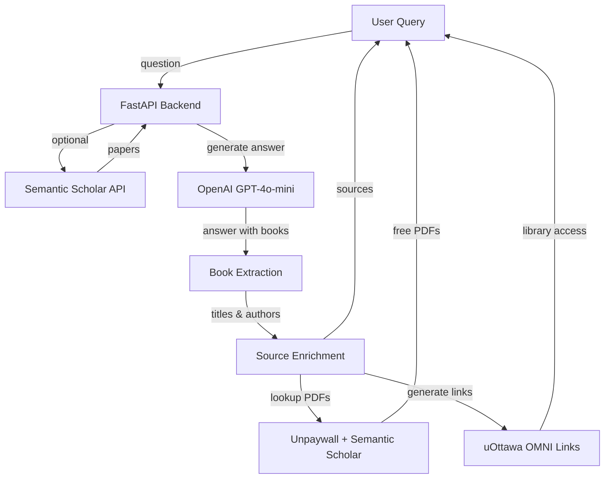

# GRAYSON - Research Assistant

[](https://www.python.org/downloads/)
[](https://fastapi.tiangolo.com/)


## Live Demo

**Try it now:** [https://grayson-7um6.onrender.com](https://grayson-7um6.onrender.com)

## Overview

**GRAYSON** is an AI-powered research assistant focused exclusively on **theology, philosophy, and biblical studies**. Built for researchers, PhD students, and enthusiasts, it provides intelligent book recommendations with direct access to academic library resources.

Origionally this project was a RAG System utilizing ChromaDB and OpenAI Embeddings. That version can be found here: https://github.com/CharSiu8/RAG_Grayson
I switched to this new liveAPI calling method because it was significantly more simple for the clients needs. All the client wanted was to be able to access sources directly in the OMNI of their university. 

### The Problem

Researchers waste hours searching fragmented databases and struggle to find academic sources referenced by AI assistants in their primary libraries. University library catalogs are often difficult to navigate, and tracking down specific theological texts across multiple platforms is tedious.

### The Solution

GRAYSON provides intelligent research assistance through:
- **AI-curated book recommendations** from scholarly works
- **Direct uOttawa OMNI library access** for every source
- **Free PDF discovery** when available
- **Smart citation extraction** from LLM-generated answers
- **"Have you considered?" prompts** for deeper research directions

## Features

### Core Functionality
- **Intelligent Book Extraction**: Automatically identifies and extracts scholarly books mentioned in AI responses
- **uOttawa OMNI Integration**: Every source includes a direct search link to uOttawa's library system
- **Dual Citation Format Support**: Handles both `"Title" by Author` and `Author in "Title"` patterns
- **Free PDF Finder**: Automatically searches Unpaywall and Semantic Scholar for open access versions
- **Semantic Scholar Integration**: Optional API integration for enhanced academic paper search
- **"Have You Considered?"**: AI-suggested related topics after each query

### User Experience
- **Clean Web UI**: Modern chat interface with dark mode support
- **Instant Library Access**: One-click access to books through institutional subscriptions
- **Usage Limits**: Built-in $5/month spending cap to prevent runaway API costs
- **Feedback System**: Users can provide feedback via Discord webhook integration

## Architecture



### How It Works

1. **User asks a question** about theology or philosophy
2. **Semantic Scholar** searches for relevant papers (if not rate-limited)
3. **LLM generates answer** mentioning scholarly books by title and author
4. **Book extraction** parses book titles and authors from the answer
5. **Source enrichment** creates:
   - uOttawa OMNI search links (title-based, always works)
   - Free PDF links (via Unpaywall/Semantic Scholar, when available)
6. **User receives** answer with actionable sources and library access

## Tech Stack

| Component | Technology |
|-----------|------------|
| **Language** | Python 3.10+ |
| **Backend** | FastAPI |
| **LLM** | OpenAI GPT-4o-mini |
| **Embeddings** | OpenAI text-embedding-3-small |
| **Academic Search** | Semantic Scholar API (optional) |
| **PDF Discovery** | Unpaywall + Semantic Scholar |
| **Library Integration** | uOttawa OMNI (OCUL Discovery Network) |
| **Frontend** | Vanilla HTML/JS + Tailwind CSS |
| **Hosting** | Render |

## Getting Started

### Prerequisites

- Python 3.10 or higher
- OpenAI API key ([Get one here](https://platform.openai.com/api-keys))
- (Optional) Semantic Scholar API key for higher rate limits

### Installation

1. **Clone the repository:**
```bash
git clone https://github.com/CharSiu8/GRAYSON.git
cd GRAYSON
```

2. **Create and activate a virtual environment:**
```bash
python -m venv .venv

# Windows
.\.venv\Scripts\activate

# macOS/Linux
source .venv/bin/activate
```

3. **Install dependencies:**
```bash
pip install -r requirements.txt
```

4. **Configure environment variables:**
```bash
cp .env.example .env
# Edit .env and add your OpenAI API key
```

Required in `.env`:
```
OPENAI_API_KEY=your-key-here
```

Optional in `.env`:
```
SEMANTIC_SCHOLAR_API_KEY=your-key-here  # For higher rate limits
DISCORD_WEBHOOK_URL=your-webhook-here   # For feedback notifications
```

5. **Start the server:**
```bash
uvicorn src.main:app --reload --host 0.0.0.0 --port 8000
```

6. **Open your browser:**
```
http://localhost:8000
```

## Usage

### Web Interface

Simply open `http://localhost:8000` in your browser and start chatting!

**Example Queries:**
- "Tell me about the historical Jesus and give me some sources"
- "What are different perspectives on the resurrection?"
- "Explain the theological significance of John 1:1"

### API

Query the system programmatically:

```bash
curl -X POST "http://localhost:8000/query" \
  -H "Content-Type: application/json" \
  -d '{"question": "What does historical Jesus scholarship say about the resurrection?", "top_k": 5}'
```

### Response Format

```json
{
  "answer": "The historical Jesus scholarship... [LLM response mentioning books]",
  "sources": [
    {
      "title": "The Historical Jesus: The Life of a Mediterranean Jewish Peasant",
      "author": "John Dominic Crossan",
      "uottawa_link": "https://ocul-uo.primo.exlibrisgroup.com/discovery/search?...",
      "free_pdf": "https://..." // if found
    }
  ],
  "library_links": {
    "omni": "https://ocul-uo.primo.exlibrisgroup.com/...",
    "jstor": "https://ocul-uo.primo.exlibrisgroup.com/..."
  }
}
```

## Project Structure

```
grayson/
├── src/                    # Backend source code
│   ├── main.py            # FastAPI application & endpoints
│   ├── llm.py             # LLM client & book extraction logic
│   ├── pdf_lookup.py      # PDF finder & uOttawa link generator
│   ├── ingest.py          # Semantic Scholar search integration
│   ├── config.py          # Configuration management
│   ├── usage_tracker.py   # Monthly spending limits
│   ├── embeddings.py      # OpenAI embeddings (for future features)
│   └── vectorstore.py     # ChromaDB wrapper (for future features)
├── frontend/              # Web chat interface
│   └── index.html         # Single-page chat UI with dark mode
├── tests/                 # Test suite
├── docs/                  # Additional documentation
├── .github/               # GitHub templates
├── requirements.txt       # Production dependencies
├── .env.example          # Environment variables template
└── README.md             # This file
```

## API Endpoints

| Method | Endpoint | Description |
|--------|----------|-------------|
| `GET` | `/` | Serve the web UI |
| `GET` | `/health` | Health check endpoint |
| `POST` | `/query` | Query with a research question |
| `POST` | `/feedback` | Submit user feedback |

### `/query` Endpoint

**Request:**
```json
{
  "question": "Tell me about the historical Jesus",
  "top_k": 5  // Number of sources to return (default: 5)
}
```

**Response:** See Response Format section above.

## Key Features Explained

### Book Extraction

GRAYSON uses dual-pattern regex matching to extract book citations from LLM responses:

**Pattern 1:** `"The Historical Jesus" by John Dominic Crossan`
**Pattern 2:** `John Dominic Crossan in "The Historical Jesus"`

Both patterns extract: `(title="The Historical Jesus", author="John Dominic Crossan")`

### uOttawa OMNI Integration

Every source includes a link to uOttawa's OMNI system:

```python
# Searches OMNI by title only (more accurate)
https://ocul-uo.primo.exlibrisgroup.com/discovery/search?
  query=any,contains,The+Historical+Jesus
  &tab=OCULDiscoveryNetwork
```

This allows students to:
- Access books through institutional subscriptions
- Check availability at library branches
- Request interlibrary loans

### Free PDF Discovery

The system automatically searches for open access versions:

1. **Unpaywall API** - Primary source for DOI-based lookup
2. **Semantic Scholar** - Secondary source for title-based search

Free PDFs appear as green buttons next to sources when found.

## Configuration

### Environment Variables

See `.env.example` for all available options. Key variables:

| Variable | Required | Description |
|----------|----------|-------------|
| `OPENAI_API_KEY` | **Yes** | OpenAI API key for GPT-4o-mini |
| `SEMANTIC_SCHOLAR_API_KEY` | No | For higher API rate limits |
| `DISCORD_WEBHOOK_URL` | No | For feedback notifications |
| `CHROMA_PERSIST_DIRECTORY` | No | ChromaDB storage path (future use) |

### Usage Limits

Built-in spending cap prevents runaway costs:
- **Default limit:** $5/month
- **Resets:** First day of each month
- **Tracking:** `usage_data.json` file

Modify limits in `src/usage_tracker.py`.

## Development

### Running Tests

```bash
pytest tests/
```

### Code Style

```bash
# Format code
black src/

# Type checking
mypy src/
```

## Contributing

We welcome contributions! Please see [CONTRIBUTING.md](CONTRIBUTING.md) for guidelines.

**Quick Start:**
1. Fork the repository
2. Create a feature branch (`git checkout -b feature/amazing-feature`)
3. Make your changes
4. Run tests (`pytest`)
5. Commit your changes (`git commit -m 'Add amazing feature'`)
6. Push to branch (`git push origin feature/amazing-feature`)
7. Open a Pull Request

## Acknowledgments

- [Semantic Scholar](https://www.semanticscholar.org/) for academic search API
- [OpenAI](https://openai.com/) for GPT-4o-mini and embeddings
- [Unpaywall](https://unpaywall.org/) for open access discovery
- [uOttawa Library](https://biblio.uottawa.ca/) for OMNI integration inspiration
- The open-source AI community

## Roadmap

- [ ] Vector database integration for paper caching
- [ ] Support for additional theological libraries (JSTOR, ATLA)
- [ ] Multi-language support for international research
- [ ] Citation export (BibTeX, RIS, EndNote)
- [ ] Advanced filtering (date range, methodology, perspective)
- [ ] 
## License

© 2025 Steven Polino — All Rights Reserved

See [LICENSE](LICENSE) for details on permitted use for recruiters and employers.
## Contact

**Steven Polino** - Project Creator

For questions or feedback, please [open an issue](https://github.com/CharSiu8/GRAYSON/issues).

---

*GRAYSON: Your AI companion for theology and philosophy research.*
