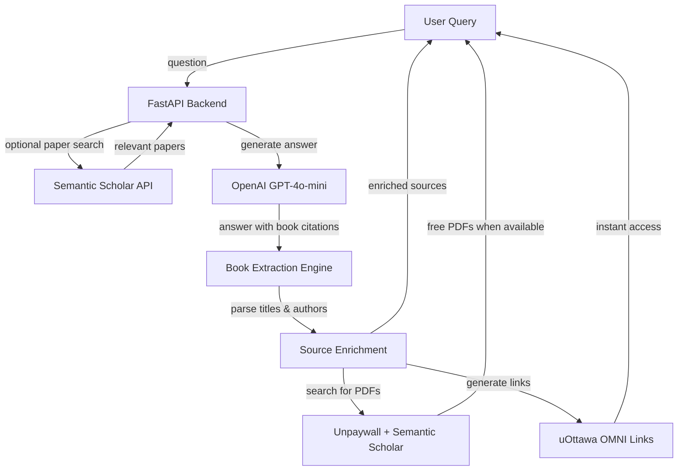

# GRAYSON - Technical Overview

## Project Summary

**GRAYSON** is an AI-powered research assistant specializing in theology, philosophy, and biblical studies. Unlike traditional RAG systems, GRAYSON uses intelligent book extraction to parse scholarly citations directly from LLM responses and provides instant library access through institutional integrations.

**Live Demo:** [https://grayson-7um6.onrender.com](https://grayson-7um6.onrender.com)

## Problem Statement

Researchers face three major challenges:
1. **Fragmented Search**: Academic resources scattered across multiple databases
2. **Library Access Friction**: AI tools recommend books but don't link to institutional libraries
3. **Irrelevant Results**: Generic academic APIs return off-topic papers

## Solution Architecture

GRAYSON addresses these issues through:
- **Intelligent Book Extraction**: Dual-pattern regex parsing of scholarly citations
- **Direct Library Integration**: Every source includes uOttawa OMNI search links
- **Free PDF Discovery**: Automatic search via Unpaywall and Semantic Scholar
- **Semantic Scholar Priority**: Clean, relevant academic paper search without query pollution

## System Architecture



## Data Flow

### Query Processing Pipeline

1. **User submits research question** via web interface or API
2. **Semantic Scholar search** (optional, rate-limited on free tier)
   - Returns relevant academic papers with abstracts
   - Falls back gracefully when rate limited
3. **LLM generates answer** (GPT-4o-mini)
   - Receives papers as context
   - Mentions scholarly books by title and author
   - Provides "Have you considered?" suggestions
4. **Book extraction** parses LLM response
   - Pattern 1: `"Title" by Author`
   - Pattern 2: `Author in "Title"`
   - Validates author length (2-50 chars) to prevent false matches
5. **Source enrichment** for each extracted book
   - Generate uOttawa OMNI search link (title-based)
   - Search Unpaywall for free PDF (DOI-based)
   - Search Semantic Scholar for free PDF (title-based)
6. **Return to user**
   - Formatted answer with inline citations
   - Source list with library links and free PDFs
   - "Have you considered?" prompt for deeper research

## Key Components

### Backend (Python + FastAPI)

**Core Modules:**
- `main.py` - FastAPI application with `/query`, `/feedback`, `/health` endpoints
- `llm.py` - LLM client, book extraction regex, prompt engineering
- `ingest.py` - Semantic Scholar API integration
- `pdf_lookup.py` - PDF discovery and uOttawa link generation
- `config.py` - Environment configuration management
- `usage_tracker.py` - Monthly spending limits ($5/month default)

### Frontend (Vanilla JS + Tailwind CSS)

**Features:**
- Clean chat interface with dark mode support
- Real-time source display with library/PDF buttons
- `/feedback` command for user feedback via Discord webhook
- Mobile-responsive design

### External Integrations

| Service | Purpose | Rate Limit |
|---------|---------|------------|
| OpenAI API | GPT-4o-mini for answers | Paid tier |
| Semantic Scholar | Academic paper search | 100 req/5 min (free) |
| Unpaywall | Free PDF discovery | Unlimited |
| uOttawa OMNI | Library search links | Unlimited |

## Technical Innovations

### 1. Intelligent Book Extraction

Traditional RAG systems query vector databases. GRAYSON extracts book citations directly from LLM-generated text using dual-pattern regex:

```python
# Pattern 1: "Book Title" by Author Name
pattern1 = r'["\']([^"\']+)["\']\s+by\s+([A-Z][^.,;\n)]+?)(?:[.,;\n)]|$)'

# Pattern 2: Author in "Book Title" (with length limits)
pattern2 = r'([A-Z][A-Za-z\.\s]{2,50}?)\s+in\s+["\']([^"\']+)["\']'
```

**Benefits:**
- No API dependency for books (eliminates rate limiting)
- LLM recommends books naturally in prose
- Faster responses (no secondary API calls)
- Always get sources even when APIs are rate-limited

### 2. Title-Only Library Searches

Initial implementation searched for `"Title by Author"` which returned poor results. Current system:
- Stores title and author separately
- uOttawa links search by **title only**
- Frontend displays `Title by Author` for user clarity
- Dramatically improved library search accuracy

### 3. Graceful Degradation

System remains functional even when external services fail:
- Semantic Scholar rate limited → LLM still provides answers with books
- Unpaywall down → uOttawa library links still work
- OpenAI rate limited → Usage tracker prevents runaway costs

## Configuration

### Required Environment Variables

```bash
OPENAI_API_KEY=your-key-here          # Required for LLM
```

### Optional Environment Variables

```bash
SEMANTIC_SCHOLAR_API_KEY=             # Higher rate limits
DISCORD_WEBHOOK_URL=                  # User feedback notifications
CHROMA_PERSIST_DIRECTORY=./chroma_db  # Future: vector DB caching
```

## Deployment

**Production:** Hosted on Render.com
- Automatic deployments from `main` branch
- Environment variables configured in Render dashboard
- Health check endpoint: `/health`

**Local Development:**
```bash
# Setup
python -m venv .venv
.venv\Scripts\activate  # Windows
pip install -r requirements.txt

# Configure
cp .env.example .env
# Add OPENAI_API_KEY to .env

# Run
uvicorn src.main:app --reload --host 0.0.0.0 --port 8000
```

## Testing & Quality

**Code Quality Tools:**
- `black` - Code formatting
- `ruff` - Fast linting
- `mypy` - Type checking
- `pytest` - Testing framework (tests pending)

**Run Quality Checks:**
```bash
make format      # Format code
make lint        # Check code quality
make type-check  # Verify types
```

## Limitations & Future Work

### Current Limitations
1. **Semantic Scholar Rate Limiting**: Free tier limits heavy testing (100 req/5 min)
2. **No Vector DB Caching**: Every query hits APIs (caching would improve performance)
3. **Single Domain Focus**: Optimized for theology/philosophy research only
4. **No Citation Export**: Cannot export to BibTeX, RIS, EndNote formats

### Roadmap
- [ ] Re-integrate ChromaDB for paper caching and offline queries
- [ ] Add JSTOR and ATLA direct integration
- [ ] Multi-language support for international research
- [ ] Citation export formats (BibTeX, RIS, EndNote)
- [ ] Advanced filtering (date range, methodology, perspective)

## Performance Metrics

**Average Response Time:**
- With Semantic Scholar: 3-5 seconds
- Rate-limited fallback: 2-3 seconds

**Cost per Query:**
- ~$0.0015 (GPT-4o-mini input + output)
- Monthly cap: $5 (configurable)

## Security Considerations

- API keys stored in environment variables (never committed)
- Discord webhook optional (feedback can be disabled)
- No user authentication (stateless API)
- Usage tracking prevents runaway API costs
- CORS enabled for frontend access

## Contact & Contributing

- **Repository**: [https://github.com/CharSiu8/GRAYSON](https://github.com/CharSiu8/GRAYSON)
- **Issues**: [https://github.com/CharSiu8/GRAYSON/issues](https://github.com/CharSiu8/GRAYSON/issues)
- **License**: MIT

See [CONTRIBUTING.md](../CONTRIBUTING.md) for contribution guidelines.
